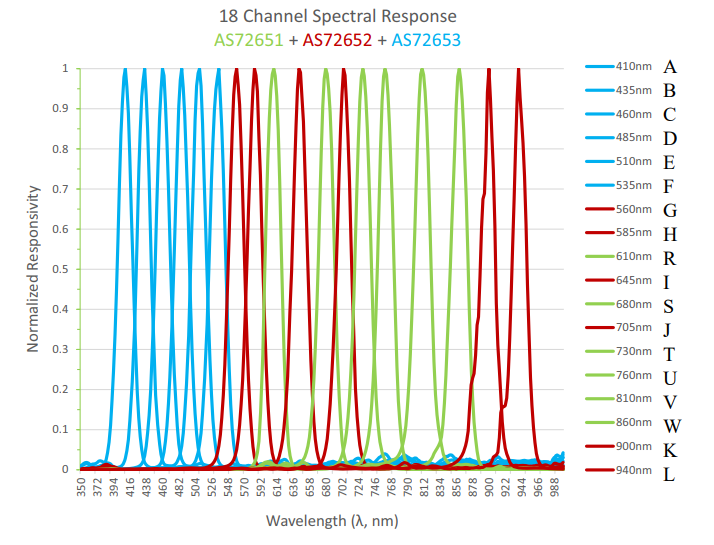

# AS7265x I2C C library for Raspberry Pi / Linux

C library and utilites to interface with AMS as7265x 18 channel spectroscopy sensor (specifically Sparkfun SKU SEN-15050)

## Build instructions

```
make
```

## Combined sensor spectral response


(from AMS AS7265x datasheet)

## Credits

Code based on Sparkfun AS7265x Arduino Library 
https://github.com/sparkfun/SparkFun_AS7265x_Arduino_Library


## License

Released under MIT license. 
